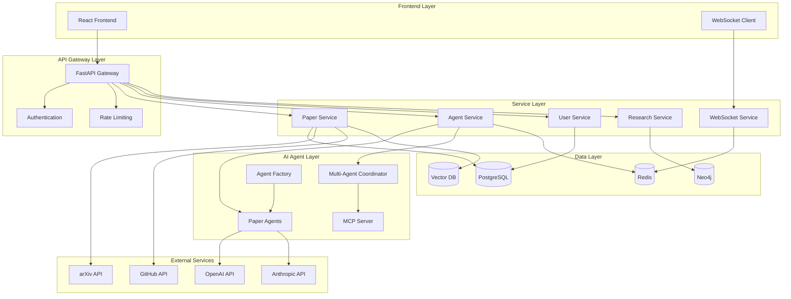

# System Architecture

## Overview

The AI Research Paper Intelligence System is built as a modern, scalable microservices architecture designed to transform research papers into interactive AI agents. The system supports both development (SQLite, local services) and production (PostgreSQL, AWS services) environments.

## High-Level Architecture



## Component Architecture

### 1. API Layer

#### FastAPI Application (`backend/main.py`)
- **Purpose**: Main application entry point with middleware and routing
- **Features**:
  - Automatic OpenAPI documentation
  - CORS middleware for frontend integration
  - Request/response logging and metrics
  - Error handling and structured responses
  - Health checks and monitoring endpoints

#### Authentication & Authorization
- **JWT-based authentication** with refresh tokens
- **Role-based access control** (RBAC)
- **Rate limiting** per user and endpoint
- **AWS Cognito compatibility** for production

### 2. Service Layer

#### Paper Service (`backend/services/paper_service.py`)
- **Responsibilities**:
  - Paper CRUD operations
  - arXiv and multi-source ingestion
  - AI-powered paper analysis
  - GitHub repository integration
  - Search and filtering
- **Key Methods**:
  - `create_paper()`: Create and validate new papers
  - `search_papers()`: Advanced search with filters
  - `analyze_paper()`: AI analysis of methodology and impact
  - `process_paper_async()`: Background processing pipeline

#### Agent Service (`backend/services/agent_service.py`)
- **Responsibilities**:
  - AI agent lifecycle management
  - Query processing and routing
  - Multi-agent collaboration coordination
  - Performance tracking and metrics
- **Key Methods**:
  - `create_agent()`: Instantiate paper-specific agents
  - `query_agent()`: Process user queries through agents
  - `multi_agent_collaboration()`: Coordinate agent interactions
  - `generate_implementation_guide()`: Create step-by-step tutorials

#### User Service (`backend/services/user_service.py`)
- **Responsibilities**:
  - User authentication and management
  - Personalized dashboard data
  - Research preferences and recommendations
  - Usage analytics and statistics
- **Key Methods**:
  - `authenticate_user()`: Login and token generation
  - `get_user_dashboard()`: Personalized research dashboard
  - `update_user_preferences()`: Research interests and settings

### 3. AI Agent Layer

#### Paper Agent (`backend/agents/paper_agent.py`)
- **Core Functionality**:
  - Individual paper understanding and interaction
  - Query classification and routing
  - Context-aware response generation
  - Implementation guide creation
- **Agent Memory System**:
  - Conversation history management
  - Paper context and metadata
  - User preferences and session data
  - Dynamic context updates

#### Multi-Agent Coordinator (`backend/agents/multi_agent.py`)
- **Collaboration Modes**:
  - **Sequential**: Agents build upon each other's responses
  - **Parallel**: Simultaneous processing and synthesis
  - **Debate**: Agents challenge and refine responses
  - **Consensus**: Collaborative agreement building
- **Coordination Features**:
  - Task distribution and load balancing
  - Response synthesis and quality assessment
  - Conflict resolution and consensus building

#### MCP Server (`backend/agents/mcp_server.py`)
- **Model Context Protocol Implementation**:
  - Agent registration and discovery
  - Message routing and delivery
  - Session management for collaborations
  - Custom protocol handlers
- **Communication Features**:
  - Asynchronous message processing
  - Broadcast and multicast messaging
  - Error handling and retry logic

#### Agent Factory (`backend/agents/agent_factory.py`)
- **Agent Management**:
  - Dynamic agent creation and configuration
  - Specialized agent types (implementation, analysis, etc.)
  - Multi-agent network creation
  - Resource management and cleanup

### 4. Data Layer

#### Database Architecture

**PostgreSQL (Primary Database)**
```sql
-- Core entities with structured data
papers (id, title, abstract, authors, categories, metadata)
users (id, username, email, preferences, statistics)
paper_agents (id, paper_id, config, performance_metrics)
agent_conversations (id, agent_id, user_id, messages, context)
research_topics (id, name, hierarchy, metrics)
```

**Neo4j (Graph Database)**
```cypher
// Relationship modeling
(paper1:Paper)-[:CITES]->(paper2:Paper)
(paper:Paper)-[:BELONGS_TO]->(topic:Topic)
(agent1:Agent)-[:COLLABORATES_WITH]->(agent2:Agent)
(paper:Paper)-[:INFLUENCES {score: 0.85}]->(paper2:Paper)
```

**Redis (Cache & Sessions)**
- Agent conversation state and memory
- API response caching
- Session management
- Real-time WebSocket connections
- Background task queues

**Vector Database (Weaviate/Pinecone)**
- Paper embeddings for semantic search
- Agent response embeddings
- Multi-modal code-paper relationships
- Similarity search and recommendations

### 5. Integration Layer

#### External API Integrations
- **OpenAI/Anthropic**: LLM services for agent responses
- **arXiv API**: Research paper ingestion
- **GitHub API**: Code repository analysis
- **Google Scholar**: Citation and metadata enrichment

#### Background Processing
- **Celery Workers**: Asynchronous task processing
- **Paper Processing Pipeline**: Content analysis and embedding generation
- **Agent Training**: Model fine-tuning and optimization
- **Data Synchronization**: Cross-database consistency

## Data Flow Patterns

### 1. Paper Ingestion Flow
```
arXiv API → Paper Service → PostgreSQL (metadata) → 
Neo4j (relationships) → Vector DB (embeddings) → 
Agent Factory (create agents) → Background Processing
```

### 2. Agent Query Flow
```
User Query → API Gateway → Agent Service → 
Paper Agent → LLM API → Response Processing → 
Cache Update → User Response + Analytics
```

### 3. Multi-Agent Collaboration Flow
```
Collaboration Request → Multi-Agent Coordinator → 
MCP Server → Agent Network → Parallel Processing → 
Response Synthesis → Quality Assessment → Final Response
```

### 4. Real-time Communication Flow
```
WebSocket Connection → WebSocket Service → 
Agent Query Processing → Real-time Response → 
WebSocket Broadcast → Frontend Update
```

## Scalability Patterns

### Horizontal Scaling
- **Stateless Services**: All services designed for horizontal scaling
- **Load Balancing**: Round-robin and weighted routing
- **Database Sharding**: Partition by research domain or date
- **Caching Layers**: Multi-level caching for performance

### Vertical Scaling
- **Resource Optimization**: Memory and CPU tuning per service
- **Database Optimization**: Query optimization and indexing
- **Connection Pooling**: Efficient database connection management
- **Async Processing**: Non-blocking I/O for high concurrency

### Auto-Scaling Triggers
- **CPU Utilization**: Scale when CPU > 70%
- **Memory Usage**: Scale when memory > 80%
- **Queue Depth**: Scale when background tasks > 100
- **Response Time**: Scale when P95 latency > 2s

## Security Architecture

### Authentication Flow
```
User Login → JWT Generation → Token Validation → 
Role-Based Access → Resource Authorization → 
Audit Logging → Session Management
```

### Data Protection
- **Encryption at Rest**: Database and file storage encryption
- **Encryption in Transit**: TLS 1.3 for all communications
- **API Security**: Rate limiting, input validation, CORS
- **Secret Management**: Environment-based configuration

### AI Model Security
- **Prompt Injection Protection**: Input sanitization
- **Response Filtering**: Content moderation
- **Usage Monitoring**: API usage tracking and limits
- **Model Access Control**: Secure credential management

## Monitoring and Observability

### Metrics Collection
- **Application Metrics**: Request rates, response times, error rates
- **Business Metrics**: Papers processed, agents created, user engagement
- **Infrastructure Metrics**: CPU, memory, disk, network usage
- **AI Metrics**: Model response times, token usage, quality scores

### Logging Strategy
- **Structured Logging**: JSON format for machine processing
- **Correlation IDs**: Request tracing across services
- **Log Levels**: DEBUG, INFO, WARN, ERROR with appropriate filtering
- **Log Aggregation**: Centralized logging with search capabilities

### Health Checks
- **Service Health**: Individual service status and dependencies
- **Database Health**: Connection status and query performance
- **External API Health**: Third-party service availability
- **Agent Health**: AI model availability and performance

## Deployment Architecture

### Development Environment
```
Docker Compose → Local Services → SQLite/PostgreSQL → 
Hot Reloading → Development Tools → Local Testing
```

### Production Environment (AWS)
```
ALB → ECS Fargate → RDS PostgreSQL → ElastiCache Redis → 
S3 Storage → CloudWatch Monitoring → Auto Scaling
```

### CI/CD Pipeline
```
Git Push → GitHub Actions → Docker Build → 
ECR Push → ECS Deploy → Health Checks → 
Rollback on Failure → Monitoring Alerts
```

## Performance Characteristics

### Expected Performance
- **API Response Time**: P95 < 200ms for simple queries
- **Agent Response Time**: P95 < 2s for complex queries
- **Multi-Agent Collaboration**: P95 < 10s for 3-agent tasks
- **Throughput**: 1000+ concurrent users, 10K+ requests/minute

### Optimization Strategies
- **Database Indexing**: Optimized for common query patterns
- **Caching**: Multi-level caching with intelligent invalidation
- **Connection Pooling**: Efficient resource utilization
- **Async Processing**: Non-blocking operations for scalability

This architecture provides a solid foundation for building a production-grade AI research paper intelligence system that can scale from prototype to enterprise deployment while maintaining high performance, reliability, and security.